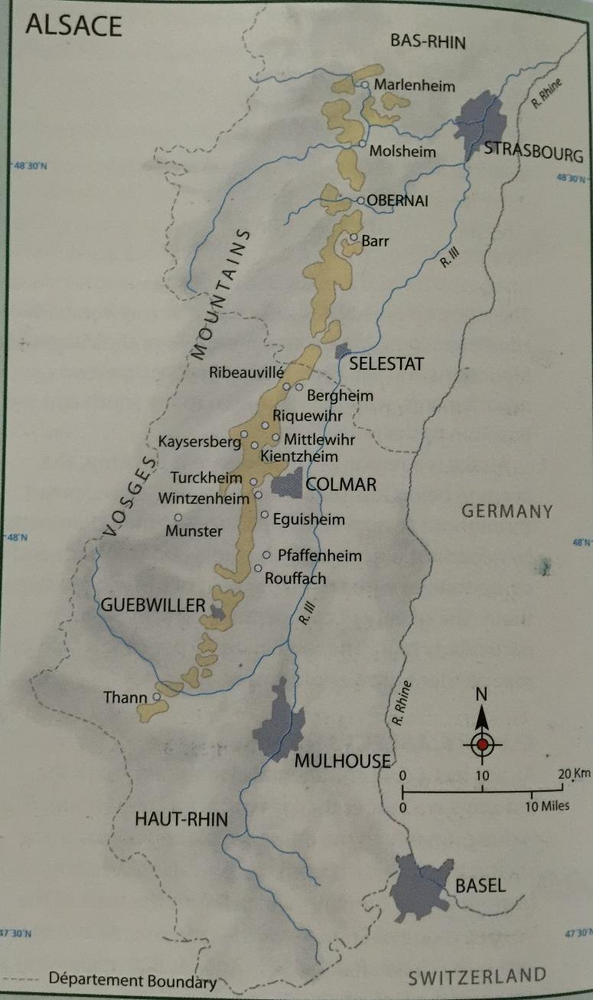

# Alsace

## 概述

### 基本情况

- 葡萄园面积 15000ha
- 位于德法之间
- 西靠 Vosges 山脉，东临 Rhine 河
- 文化和酿酒都受到德法双方影响

### 历史发展

- 一战前由德国所有
    - 生产大批量葡萄酒
    - 根瘤蚜爆发后，种间杂交品种大量种植
    - 山坡土地大量废弃
- 归属法国后的发展：
    - 1925 年禁止 hybrid vines
    - 1962 年建立 AC 体系
    - 1972 年确立笛形瓶规范
    - 二战后才建立葡萄酒声望
    - 90%为白葡萄酒

### 地理位置

- 全长 140km，东西很窄（4km）
- 跨过两个法国省份：
    - 南边的 Haut-Rhin 省
    - 北边的 Bas-Rhin 省
- 遍布许多小的 commune：
    - Eguisheim
    - Guebwiller
    - Pfaffenheim
    - Ribeauville
    - Riquewihr
    - Turkheim
    - Barr 等
- 特点：
    - 南部集中更多生产商
    - 质量更高
    - 特别适合琼瑶浆、灰皮诺等饱满品种

## 气候

### 总体特征

- 凉爽的大陆性气候
- 秋季漫长而干燥
- Vosges 山脉阻挡西边带雨的风
- Lorraine 为全法最潮湿地区之一
- Alsace 为全法最干燥地区之一

### 具体数据

- 年均降雨量 500mm
- 夏季晴朗炎热
- 秋季晴朗干燥
- 年日照超过 1800 小时
- 葡萄能获得极高糖分含量

### 气候挑战

- 炎热年份可能出现干旱
- 夏季偶有暴风雨夹杂冰雹
- 寒冷冬季：
    - 让葡萄休眠
    - 极冷天气可能冻死葡萄藤
    - 春霜是个问题
- Colmar 镇附近温度比 Alsace 平均温度高出一度

## 土壤

### 葡萄园位置

- 最好的葡萄园在陡峭斜坡上
- 斜度可达 40 度
- 朝向东或东南
- 北部 Bas-Rhin 省特点：
    - 气候凉爽
    - 受山脉保护较少
    - 平原葡萄难以充分成熟
    - 平原葡萄多用于 Cremant d'Alsace

### 土壤类型

地质变迁频繁，土壤类型丰富：

1. 山顶：

    - 土层薄
    - 土壤类型：
        - granite
        - 片麻岩 gneiss
        - schist
        - quartz
        - clay
        - volcanic
        - sandstone
    - 分布在不同村庄之间

2. 山脚斜坡：

    - 土壤类型：
        - limestone
        - sandstone
        - clay
        - marl
    - 土层厚度：50cm 到 6m 不等

3. 平原：
    - 以冲积土 alluvial 为主
    - 类型多样
    - 需要根据土壤选择合适 rootstock

### 土壤影响

- heavier 的 clay 和 marl 倾向生产更加饱满浓郁的风格
- lighter 的 limestone 和 sandstone 倾向生产更加轻盈优雅的风格
- schist、slate 等土壤有更多 oily，mineral 的风味（如 gunflint）

## 品种

### 概述

- 品种比产区更为关键
- 只有四个贵族品种可以做 VT、SGN 和 Grand Cru
- 其他品种也可标注在酒标上
- 最优质酒特点（除 VT 和 SGN 外）：
    - 干型
    - 饱满
    - 较高酒精度
    - 兼具果香和香料气息
- 近期趋势：
    - 越来越多葡萄酒（尤其 Grand Cru 级别）开始有明显甜度
    - 缺乏甜度标示法规，消费者难以通过酒标区分

### 主要品种

**Riesling**：

- 种植量：约占 25%，最广泛的贵族品种
- 风格特点：
    - 与德国风格不同
    - 优质雷司令展现：
        - 饱满酒体
        - 干型
        - 较高酒精度（12.5%左右）
        - 高酸
        - 明显打火石 flinty 矿物感
        - 凉爽气候下的花果香气
    - 现今多保留残糖
- 特性：
  - 能很好反映风土
    - 制作极为优质的 VT 和 SGN 风格
    - 果粒较硬
    - 成熟时间晚
    - 适合晚收
    - 喜欢 granite 和 schist 土壤
- 最好葡萄园：来自 Wolxheim、Dambach-la-Ville、Scherwiller 等小镇周围

**Gewurztraminer**：

- 特征：
    - 充满甜香料、荔枝、玫瑰等香气
    - 表皮粉红
    - 酒色金黄
- 风格：
    - 饱满而油滑
    - 干型或 off-dry
    - 酸度中低
    - 酒精度高，常超过 14 度
    - 口感偏甜
- 种植：
    - 常种植在山脚下较深的 marl，clay soils
    - 占 20%种植量
- 特别适合 VT 风格：
    - VT 风格有夸张的异域果香
- 搭配：
    - 熏鱼
    - 奶酪
    - 中式/泰式餐点
- 最好葡萄园：来自 Barr 等小镇周围

**Pinot Gris**：

- 历史：
    - 以前标作 Tokay d'Alsace 或 Tokay Pinot Gris
    - 06 年后为防歧义删去 Tokay
- 产量：占 12%左右
- 最好的灰皮诺特点：
    - 酒色金黄
    - 饱满
    - 高酒精度
    - 风味不那么芳香但入口结构饱满
    - 风味浓郁
    - 充满新鲜水果和果干风味
    - 有些烟熏、蜂蜜味
    - 往往含有一点残糖
- 用途：
    - 能生产优质 VT 和 SGN 风格
    - 也做起泡酒
- 种植特点：
    - 产量不稳定
    - 适合 clay 含量高的较深细腻土壤
    - 适合火山岩土壤
- 最好葡萄园：来自 Obernai 和最北部的 Cleebourg 等小镇

**Muscat**：

- 地位：贵族品种但种植量只占 3%
- 种植难点：
    - 容易落花 coulure 和腐烂 rot
    - 产量不稳定
- 品种：
    - 最好的是小粒麝香（Muscat a Petit Grain，也叫 Muscat d'Alsace）
    - Muscat Ottonel 种植量更多（产量更稳定但风味较淡）
- 风格：
    - 往往是干型
    - 充满麝香葡萄香气
    - 酒精度和酸度都较低
- 种植：
    - 适合 sandy 和 calcareous 土壤
    - VT 和 SGN 风格不太常见

**Pinot Blanc 和 Auxerrois**：

- 混合特点：
    - 两个品种常混合生产
    - 酒标写 Pinot Blanc 表示两个品种混合
    - 酒标写 Auxerrois 表示单一品种
- 风格特点：
    - Pinot Blanc：细腻的苹果、桃子和花香，口感轻柔，酸度新鲜
    - Auxerrois：与 Pinot Blanc 相似，但更饱满和有香料味
- 种植量：
    - 两品种加起来约占 20%
    - 比 Riesling 略少
    - 产量逐渐增加
- 种植特点：
    - 早熟（在 Alsace 第一个成熟）
    - 能适应肥沃平坦土地
    - 不需要贫瘠斜坡
- 用途：
    - 常用于起泡酒
    - 生产轻盈新鲜，相对 neutral 的静止酒
    - 酒体饱满度和香气复杂性不及贵族品种
    - 也能生产很少量的 VT、SGN 和 Grand Cru

**Sylvaner**：

- 种植情况：
    - 曾种植面积广
    - 如今剩 9%
    - 集中在 Bas-Rhin
- 产品特点：
    - 口感轻柔
    - 低酒精度（10.5-11.5%）
    - 高产量
- 风味：
    - 精致的白花、青草、柑橘香气
    - 有一定饱满度
    - 远不及琼瑶浆
    - 适合年轻时饮用
- 特殊情况：
    - 只有少量老藤和特殊风土能制作出优质的类似 Franken 的 sylvaner

**Pinot Noir**：

- 种植：
    - 出于对红葡萄酒需求，种植量增加
    - 占 10%
    - Alsace 唯一红葡萄品种
- 特点：
    - 缺乏酒体和浓缩度
    - 属于轻盈果香型红酒或桃红
- 创新：
    - 部分生产者尝试用新橡木桶培养以酿造更加饱满风格
- 用途：
    - 生产起泡酒 Cremant Rose 和 Blanc de Noirs
    - 不需要用笛形瓶装瓶
- 种植：常种植在与勃艮第相似的 sandy 和 limestone 土壤上
- 优质产区：
    - Bas-Rhin 的 Ottrott、Marlenheim
    - Haut-Rhin 的 Rodern

其他品种：

- **Chasselas**：
    - 存在于 Edelzwicker 和 neutral wine 中
    - 不允许种植新葡萄藤
    - 计划逐渐淘汰
    - 能在各式土壤和气候下生存
- **Chardonnay**：
    - 可用于起泡酒
    - 可标为 Pinot Blanc
    - 与 Pinot Blanc 外形相似

## 种植

### 种植方式

- 斜坡栽培：
    - 整形靠近地面
    - 根据朝向设计以获取最多阳光辐射
    - 手工采摘
- 平原栽培：
    - 葡萄藤栽培较高以减少春季霜冻影响
    - 可以允许机械采摘

### 整形方法

- Single/Double Guyot 是常用整形方式
- 种植密度大（4400-4800 株每公顷）
- 老藤则更多采用 Cordon-trained 方法
- 产量控制：
    - 最高产量限制不严格
    - 可达 100hl/ha，每年浮动
    - 优质酒产量一般在 40-50hl/ha

### 种植特点

- 有机和生物动力常见：
    - 生产者愿意展示风土特色
    - 病虫害威胁较少
- 行间管理：
    - 常种些草以防水土流失
    - 限制葡萄产量
    - 减少潮湿和真菌威胁

### 采收挑战

- 不同地块种植不同品种
- 品种成熟时间不一
- 采收季漫长（9 月中旬到 11 月底或 12 月初）
- 除正常成熟葡萄外还有：
    - 晚收酒
    - 贵腐酒
    - vin de paille
    - eiswine

## 酿造

### 酿造理念

- 认为最好的葡萄酒来自最少人工干预
- 目标是展现并最大化保持第一类果香

### 酿造工艺

- 压榨：
    - 使用 pneumatic press 充气式压榨机
    - 3 小时内完成以减少果皮接触
- 发酵：
    - 在古老大型橡木桶中发酵
    - 这些橡木桶常超过百年历史
    - 有厚厚的酒石酸沉淀（tartrate deposit）
    - 不会给酒增加任何风味
- 现代酒庄：
    - 不锈钢容器更常见
    - 可以控温
- 其他特点：
    - Chaptalisation 很常见（全球变暖后在减少）
    - 发酵后残留糖份很普遍
    - 发酵一般持续 3-4 周
    - racking 后与 fine lees 继续接触

### MLF 使用

- 除了 Pinot Blanc，一般不常经过 MLF
- 避免破坏果香的新鲜度
- 但也时有发生

### 装瓶时间

- 一般酒：
    - 在来年春季装瓶
    - 适合立即饮用
    - 新鲜而年轻
- 优质酒：
    - 经历一段时间酒泥接触
    - 在来年五到八月装瓶
    - 有的可以经历瓶中陈年以发展复杂风味

## 法规

### 概述

- 从某种意义上来讲，Alsace 的法规十分简单
- 只有两个 AC
- 生产者常使用未法定的术语宣告质量：
    - Reserve Personnelle
    - Cuvee Speciale
- 静止酒占 75%

### Alsace AC

- 建立：1962 年
- 产量占比：约 70%
- 特点：
    - 大多数是白葡萄酒
    - 产量限制为 80hl/ha
- 酒标要求：
    - 常出现品种名称（表示 100%单一品种）
    - 也有少量 blends
    - 都用当地笛形瓶（flutes d'Alsace）装瓶
- 如标注村庄或 lieu-dit 名字：
    - 需遵循更严标准
    - 需更小产量

### Alsace Grand Cru AC

- 建立：1975 年
- 特点：
    - 有 51 个规定范围的葡萄园
    - 产量仅占 4%
- 严格规定：
    - 必须来自单一葡萄园
    - 较低最大产量（55hl/ha）
    - 较高种植密度
    - 必须人工采摘
    - 较高成熟度
    - 必须使用贵族品种（雷司令、麝香、琼瑶浆和灰皮诺）
- 例外情况：
    - Kaefferkopf 和 Altenberg de Bergheim 允许不同品种 blending
    - Zotzenberg 允许 Sylvaner
- 特别规定：
    - 每个特级园可通过工会更严格规定
    - 可包括：禁止 chaptalisation、限定品种、确定采收日期等
- 酒标要求：
    - 需标注葡萄园名称
    - 年份
    - 品种（100%的情况下）

### 特级园争议

- 主要问题在于葡萄园边界
- 原因：
    - 无按葡萄园卖酒习俗
    - 最好地块未能清楚划分
- 导致问题：
    - 许多特级园面积过大
    - 有的达不到很高质量水平
    - 如 schlossberg 超过 80ha
- 因此生产商也很重要

### VT 和 SGN 术语

- 根据葡萄成熟度划分
- 类似德国 Pradikate 分级
- Alsace AC 和 Alsace Grand Cru AC 都可使用

**Vendange Tardive（VT）**：

- 晚收葡萄
- 品种要求：只能用四种贵族品种
- 糖分要求：
    - Riesling 和 Muscat：14%（糖含量 220g/L）
    - Pinot Gris 和 Gewurztraminer：15.3%（糖含量 243g/L）
    - 基本相当于德国 Auslese
- 特点：
    - 最好的葡萄经历风干 passerillage
    - 可能有贵腐影响
    - 禁止糖强化
    - 可从干型到中等甜度
    - 法律无具体要求
- 监管：
    - 需要当局监管
    - 设定采收日
    - 检测糖度
    - 装瓶后的检测

**Selection de Grain Nobles（SGN）**：

- 贵腐精选
- 品种要求：只能用四种贵族品种
- 糖分要求：
    - Riesling 和 Muscat：16.4%（糖含量 256g/L）
    - Pinot Gris 和 Gewurztraminer：18.2%（糖含量 279g/L）
    - 其他规定与 VT 一致
    - 基本相当于德国 Beerenauslese
- 特点：
    - 不是年年生产
    - 产量极小
    - 都是甜型
    - 贵腐影响程度各不相同

## 市场

### 产业结构

- 葡萄田归属分散：
    - 酒农平均田产不到 3 公顷
    - 总共 4000 多个酒农
    - 超过 2000 个田地不到 2ha
    - 这些酒农不单靠葡萄种植或酿酒维生
- 田产分布：
    - 一半属于酒农
    - 1/3 属于 co-operative
    - 酒商拥有不到 5%
    - 酒商向酒农购买大量葡萄

### 酿酒生产

- 由 negociant 主导
    - 代表：Hugel 和 Trimbach
- 合作型酒庄也生产高品质葡萄酒
- 产量分布：
    - 酒商 41%
    - 合作性酒庄 39%
    - 独立酒农 20%
- 生产特点：
    - 小酒农生产 6-8 种不同葡萄酒
    - 大生产商可达 20-30 种

### 市场销售

- 25%用于出口
- 主要市场：
    - Belgium/Luxembourg
    - 荷兰
    - 德国
    - 丹麦
    - 英美等

### 重要生产商

**Hugel**：

- 地位：Alsace 最知名最古老生产商之一
- 历史：建立于 17 世纪
- 规模：自有 26ha 葡萄园
- 主要品种：
    - Riesling
    - Gewurztraminer
    - 灰皮诺
    - 黑皮诺
- 产品线：
    - 普通系列
    - 较饱满的 tradition 系列
    - 最好的 Jubilee 系列
    - 特别优质的 VT 和 SGN
- 态度：
    - 反对 Grand Cru 体系
    - 认为不能代表质量
- 经营模式：
    - 既是酒商也购买葡萄
    - 基本系列用购买的葡萄
    - 高端系列用自己葡萄园葡萄

**Trimbach**：

- 历史：建立于 17 世纪
- 特点：
    - 古老而知名
    - 酒风格果香精美
    - 酸度较高
    - 有不错陈年能力
- 著名产品：
    - Clos Ste-Hune Riesling
    - Cuvee Frederic Emile Riesling
    - 优雅、珍稀且极能陈年
- 经营模式：既是酒商也是葡萄种植者
