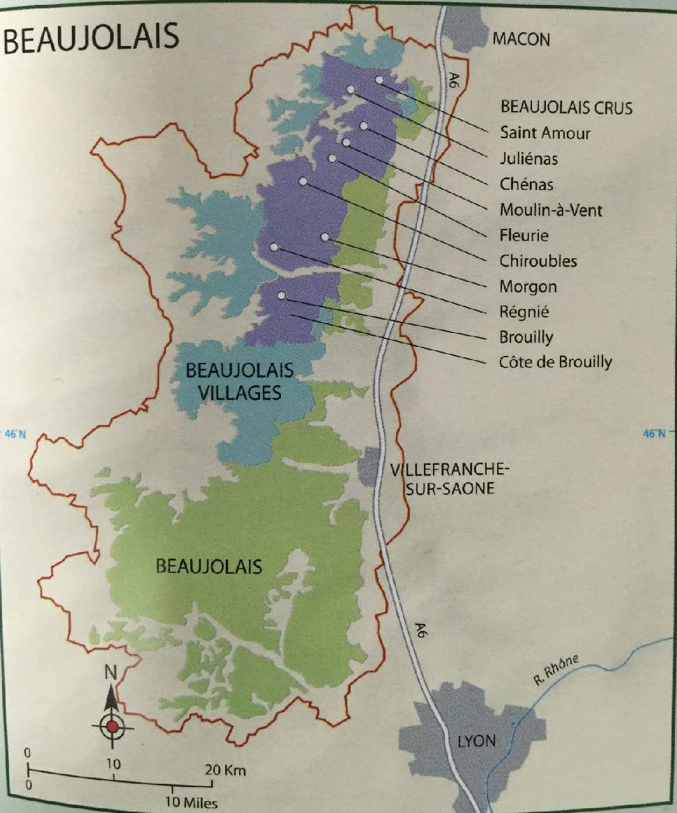

# Beaujolais

## 概述

博若莱经常被视为勃艮第的一部分，但是这里的土壤、品种、气候乃至风格都与勃艮第不相同。这里 99%都是红酒，以 Gamay 作为葡萄品种，而 Chardonnay 白酒只占 1%，还有少量桃红和起泡。一般而言，简单易饮的风格占大多数，也有少量复杂且有陈年能力的。面积 20000ha，产量和勃艮第差不多。

## 气候

半大陆性气候，受到地中海气候影响，比勃艮第温暖干燥。春天凉爽潮湿，有 frost 威胁；夏天温暖干燥，利于葡萄积累糖分；秋天温暖时常有雨，真菌疾病需防治；冬天较为寒冷，葡萄会冬眠。

## 土壤

最好的 Gamay 生长在花岗岩土 granite soils，主要分布在北部和西部山丘起伏连绵的地区，给 Gamay 带来结构和复杂感。东部是 alluvial soils，由 Saone 河带来。南部是 limestone soils，葡萄酒口感清爽。

Granite 是一种颗粒粗糙的、可以看到晶体颗粒的岩石，由石英灯其他矿物质共同构成。在 Moulin-a-vent，葡萄酒生长在一层薄薄的由花岗岩分解而成的土壤上。花岗岩土比较贫瘠，排水性很好。

## 品种

Gamay 占 98%，充满了芳香的红莓和樱桃香气，单宁很低，不易腐烂。发芽、开花和成熟时间都很早，容易受到 spring frost 影响但同时也能在凉爽环境成熟。富有活力，适合 gobelet 整形。此外还能见到很少的 Chardonnay，Aligote 甚至 Pinot Noir，它们除了单独酿酒之外，更常小比例地混入 Gamay 中酿酒，不超过 15%。

## 种植

大部分使用 gobelet 整形法，spur pruned，然后将 shoots 绑在一起以使它们与地面垂直。南部地区也使用 single Guyot 方法。这里的种植密度很大。

## 酿造

为了突出 Gamay 的品种特点，这里常使用一种特殊的 carbonic maceration 二氧化碳浸渍法（Semi-carbonic maceration）以提取颜色和果香，同时只提取很少的单宁。手工整串采摘的葡萄被倒入大发酵容器中，底部的 10-30%的葡萄被挤破正常发酵，二氧化碳产生，上部完整的葡萄因此进行细胞内发酵，即二氧化碳浸渍发酵。这种酒有着 kirsch，香蕉，口香糖和肉桂香气。为了使用这种酿造方法，需要手工采摘整串葡萄。但是 cru 级别的也常使用传统的酿造方法，并常使用大橡木桶熟化。

另外这里十分流行 chaptalization，经常在葡萄达到最低酒精度要求（10 度）的时候就采摘，然后糖强化到 13 度左右。

## 产区

### Beaujolais AC

分布在产区东边的由 Saone 河带来的冲积平原 alluvial plain 和南部的 limestone-based 的地区。这里的葡萄藤用 wires 整形，土地平整，一般使用 carbonic maceration 酿造。偶尔有 Beaujolais Superieur AC，最低酒精度为 10.5 度而不是普通 AC 的 10 度。偶尔能见到少量 Chardonnay 做的白酒以及桃红葡萄酒。

### Beaujolais Nouveau

也大多在 Beajolais AC 所属于的这一片地区生产，也有属于 Beaujolais Villages AC 的，但是不能属于 10 个 crus AC。博若莱新酒需要快速饮用，占年产量的 1/3，原来在英法时髦，现在转移到了日本等地。只能在当年的 11 月的第三个星期四之后发售，来年的 8 月 31 日以后便不得再由酒商或种植者销售。还有一种 Beaujolais Primeur 与之相似，不能在来年 1 月 31 日之后销售。新酒不是博若莱的专利，但是博若莱的新酒绝对是推广得最成功的。

### Beaujolais Villages AC

分布在北部和西部的一些地区，有连绵的山丘，土壤以花岗石的页岩 granitic schist 为主，一般不借助栽培架式，禁用 Guyot，主要采用 gobelet 整形。Gamay 喜欢 granite，相比南部的 sandy soil，花岗岩能让其获得更好的浓缩度。39 个村庄属于这个子产区，产量占 1/4，经常互相混合，也有在酒标上标有单一村庄名字的。

### Beaujolais Crus

在偏北部的花岗岩山丘之间，有 10 个最优质的村庄，属于 Beaujolais crus。它们只酿造红酒，总面积 6200ha，只允许短枝修剪，以 gobelet 整形最为常见。产量限制 56hl/ha，手工采摘。它们一般采用传统的酿造方法，有的也会使用橡木桶熟化（大橡木桶居多）。在每个 cru 之内都有一些知名的地块 climats，对酒精度要求稍高（10.5 度，普通的 cru 为 10 度），且名字可以出现在酒标上。

这些 crus 从北到南分别是：

1. **Saint-Amour**：最北部的产区，也生产白葡萄酒。这里的红酒酒体较轻，村庄的名字和故事增加了其销量。土壤为 granite 和 clay，根据浸渍时间不同，有清爽和饱满两种风格。

2. **Julienas**：有一定结构感，但一般需要在 2-3 年内饮用。

3. **Chenas**：最小的村，285ha，Hubert Lapierre 是最可靠的生产商。陈年潜力不错，充满花香，优质的可放 8-10 年。

4. **Moulin-a-Vent**：酒体饱满，单宁强劲，最有陈年潜力，陈年后的酒有勃艮第老酒的风味。最出色的生产商为 Chateau des Jacques，其由 Louis Jadot 所有。

5. **Chiroubles**：海拔最高，风格最轻柔，非常芳香，适合年轻时饮用。

6. **Fleurie**：花香风格，村名好听，价格较高，口感轻柔优雅。

7. **Morgon**：饱满强劲，有陈年潜力，1100ha（第二大），最优质的地块叫做 Cote de Py，最出色的酒之一为 Duboeuf 的 Jean Descombes。

8. **Regnie**：最新加入，1988 年被归入 cru，有酸樱桃等红色果香。

9. **Cote de Brouilly**：310ha，位于山上，是唯一一个具有四面朝向葡萄园的村子，更加浓缩且有陈年能力，Chateau de Thivin 很有名。

10. **Brouilly**：面积最大，1300ha，产量最大，富有结构与活力。

## 市场

Negociants（尤其是 Duboeuf）和 co-operative 扮演主要作用。Georges Duboeuf 对推广博若莱至关重要，控制着目前博若莱 10%的产量。他引领了博若莱使用温控设备、不锈钢容器、果香风格等风潮，并让博若莱新酒得以风靡世界。他鼓励酒庄装瓶，但同时与超过 20 个合作社和 400 多位种植者合作，印记布满整个博若莱产区。
