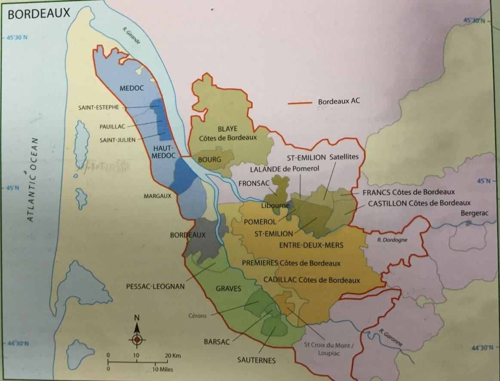

# Bordeaux

## Bordeaux 概述

### 历史与概述

波尔多无论从产量还是价值上而言，都是法国最大的 AC 产区，11 万公顷，近 8000 家酒庄，有一些最杰出的在市场上炙手可热的干红、甜白和干白，却也有更多在国际市场上难有竞争力的廉价酒。早在公元 300 年这里就有栽培葡萄的记载，但直到 1152 年当其受到英国的统治之后，其葡萄酒最先开始在英国流行起来。与其他许多欧洲产区不同的是，这里葡萄酒产业的兴盛并不是依靠当地的僧侣，而是来自英国、荷兰和德国的酒商带动了这里的葡萄酒业。13 到 14 世纪的英法战争，再加上税收的增加，让这里的贸易严重下滑。

在 17 世纪以前，Medoc 是一片湿地 swamp，荷兰人来到这里排水并栽培上了葡萄。1855 年的分级给这里带来了新的生机，奠定了波尔多顶级葡萄酒的地位。之后，powdery mildew 和根瘤蚜等威胁轮番侵袭这里，让波尔多差点经历灭顶之灾。

二战以后，Mouton-Rothschild 率先开始在酒庄装瓶，引领了潮流。20 世纪末和 21 世纪初，经济的迅猛发展让波尔多的顶级酒价格飞速增长，但廉价的波尔多酒却难以销售。波尔多葡萄酒由于缺乏品牌建设和市场策略，在国际市场上屡屡受到澳大利亚等新世界葡萄酒的冲击。随着减少使用硫并引入了不锈钢和温控技术，波尔多的白葡萄酒酿造技术有了很大提升，酿造者们也能够通过避免 MLF 等手段更好地展现果香并使之在瓶内保持更长的时间。一般而言发酵温度在 15-20 度之间，这种较长时间凉爽环境下的发酵能最大限度地提取品种的风味。优质的干白（比如 Pessac Leognan）也常用新橡木桶发酵和熟化，给酒在果香之外增加饱满度和浓郁的坚果风味。

波尔多最优质的甜酒几乎都是贵腐酒，酒精度较高，需要在葡萄园内多次手工采摘并挑选贵腐葡萄，可持续 2 个月。最优质的会在新橡木桶内发酵和熟化，可长达 3 年之久。一般而言 Semillon 占的比例会非常高，有时可达 100%。

### 气候

波尔多位于北纬 45 度，为温和的海洋性气候，受到墨西哥湾暖流 Gulf Stream 的影响，使这里的生长季延长到 10 月份（但也可能由于过热或降雨导致提前采摘）。虽然岸边的森林和沙丘挡住了海面吹来的大风，但大西洋依然带来了年均 850-950mm 的降雨，分布在全年，经常影响开花、坐果、发霉并影响采收（落果 coulure，成熟不均 Millerandage）。因此，波尔多的年份差异明显，但顶级生产商能通过拣选来减少年份带来的风格和质量差异。

总体来说，春季潮湿，偶有 frost 影响；夏天温暖，但时有阴云遮蔽，造成果香没那么浓郁；秋天不稳定，有时是收获季节的雨水影响年份；冬天温和，偶有严寒。

### 土壤

波尔多的土壤差异很大，水资源的利用能力和热量的储存能力的不同决定了适宜不同的品种成熟。总的来说，这里有四种主要的土壤。

冲积土位于河岸边，主要用来酿造最便宜的大区酒。石灰岩土壤相对温暖，适合品丽珠；黏土相对凉爽潮湿，适合梅洛；这两种土壤也是 St-Emilion 主要的土壤类型。砾石土壤排水性极好，且能吸收热量最为温暖，适合赤霞珠，主要位于 Haut-Médoc 和 Pessac-Léognan 的最好的葡萄园中。

### 品种

由于历史上天气的不稳定，波尔多人选择种植多种葡萄来规避风险，花期和采收期的不同使得不至于颗粒无收。比如梅洛成熟时间早，但容易落果；赤霞珠成熟晚，容易受天气影响。因此，波尔多法律允许种植多达 14 种葡萄，但如今只有 3 种红葡萄和 2 种白葡萄被普遍种植，88%为红葡萄，12%为白葡萄。

#### 红葡萄品种：

##### Cabernet Sauvignon（赤霞珠）

在波尔多为赤霞珠能成熟的最北部，约 25000ha，占红葡萄种植量的 1/4，主要分布在 Haut Medoc，但在整个左岸都比较重要。赤霞珠适合富含砾石 gravel/stone 的土壤，反射热量以帮助成熟。在最优质的酒中可达到 3/4 左右的比例，单宁强劲酸度高，酚类物质丰富，与橡木桶结合得非常好且有着明显的黑醋栗风味，有数十年的陈年能力。赤霞珠常与梅洛混合，而不成熟时单宁会过于突出且有许多生青的风味。作为一个色深粒小皮厚的品种，其发芽和成熟时间都比较晚，其生长旺盛因此适合活力较弱的砧木。

##### Merlot（梅洛）

这是波尔多种植最广泛的葡萄品种，近 7 万公顷，占红葡萄种植量的 60%，酒体饱满，单宁适中，比赤霞珠熟化得更快。当与艰涩的赤霞珠混合时，能提供更加柔和的口感和饱满的酒体，糖分高因此酒精度较高，但也能从赤霞珠或品丽珠中补充一些果香、颜色和单宁。梅洛在右岸也能很好地成熟，在优质的酒中一般占到 60%左右的比例。但除非产量控制的很低，梅洛常显得缺少个性，这种柔和的特点使得梅洛更适合用来酿造一些廉价的酒。梅洛发芽、开花和成熟的时间比赤霞珠早一个星期，但也更易受到春季霜冻的影响，而且容易落果。在相对凉爽潮湿的土壤上（比如右岸），它比赤霞珠更易成熟。

##### Cabernet Franc（品丽珠）

主要种植在 Saint-Emilion，在左岸也有一定的种植量，但均不是当地最重要的品种。品丽珠与赤霞珠一样，喜欢排水性好的温暖的土壤，但一般而言其酿的酒与赤霞珠相比，缺少酒体、单宁和细腻感（成熟也更快），但也有例外。不成熟时其有明显的生青和梗的味道，但成熟后有出色的芬芳，因此它经常参与混合。

##### Petit Verdot

只在最炎热的年份成熟，能酿出颜色极深，单宁很高的酒，陈年能力很强。在波尔多，其在混合中往往只占有很小一部分，但却能明显增加单宁、颜色和一些香料风味。

> Malbec 和 Carmenere 也允许种植，但越来越罕见。

#### 白葡萄品种：

##### Semillon

是种植最广泛的白葡萄品种，占白葡萄种植量的 55%，皮薄易受贵腐影响，常用来酿甜酒。Semillon 能给酒带来金色的色泽以及饱满的酒体，适合用橡木桶熟化，也有不错的陈年能力。Bordeaux 的 Semillon 无论是干是甜，其饱满而富有质感的特点是独有的，低产、老藤加橡木桶造就了其特点。

##### Sauvignon Blanc（长相思）

波尔多的长相思有着特殊的草本，青草和 elderflower 的香气，因此有着越来越多的单一品种酿的酒。在混合中，其高酸能平衡 Semillon 的饱满，这在一些甜酒中尤其重要。

##### Muscadelle

有着明显的葡萄和花香，在一些甜白和干白中扮演重要的辅助作用，但混合比例往往不高。年轻时香气突出，但陈年能力较差，比如滴金酒庄就不使用其酿造贵腐甜白。

> 此外白葡萄品种还有少量的 Ugni Blanc，Colombard，Merlot Blanc，Folle Blanche，Mauzac 等次级品种，比例很小。

### 种植

总的来说采用高密度的种植（5000-6000 株每公顷），使用离地面较低的铁丝来进行 Guyot 整形。随着一些高产量的砧木被移除，更适宜的砧木被重新种植，葡萄园总体质量在不断提升。葡萄园管理技术也在进步，特别是正在逐渐克服阴雨天气带来的真菌疾病和成熟不均的问题。通过 VSP 整形，green harvest，除叶以及减少农药喷洒（除潮湿带来的真菌疾病）等手段，葡萄能更好地成熟，而施肥和杀虫剂的使用能增加产量。波尔多最著名的农药就是波尔多液 Bordeaux mixture，含铜的硫酸盐 copper sulfate，能防止真菌和细菌疾病，呈蓝色，是为数不多的在有机种植甚至生物动力发种植中被允许使用的化学剂。

大部分葡萄园采用机械采收，手工采摘主要用于甜酒的生产。传统上一般是在开花后 100 天进行采摘，但为了追求更高的成熟度和天气预报的普及，现在大多是在花开后 110 天采摘。最优质的生产商还会在采摘后通过手工或精密仪器来拣选葡萄。在潮湿的年份或者有春季霜冻危险时，顶级酒庄还能雇直升机来搅动空气，吹干葡萄或者避免霜冻。

### 酿造

在红酒的酿造上波尔多并没有形成统一的意见，特别是质量和风格的不同会导致不同的酿造方法。虽然大多数的生产商都会在发酵前除梗（也有不除梗以增加单宁的），但何种发酵容器最适合酿造好酒却没有定论，一些最优秀的生产商会使用传统的橡木桶容器，加上不锈钢甚至是水泥发酵罐，来为最后的混合提供多样的选择，发酵容器统称为 cuve。一般发酵（1 周左右）和之后的浸皮总共会持续 3-4 周左右。在酒帽管理上，同样有着各式的做法，有的强调精密而复杂的管理，有的则更加自然而温和。糖强化的使用比较普遍，一些优质酒庄会使用反渗透 reverse osmosis 来应对较差的年份，而好年份则会避免对葡萄醪的强化。还有 micro-oxygenation 微氧化技术的使用也可以帮助发酵的顺利进行，避免还原现象，柔化单宁并帮助熟化。

大多数的酒都会分别酿造，熟化之后在来年的春天进行混合，为了保证每个生产商最优秀的酒的品质，它们常用那些没达到要求的基酒来生产副牌 second wines 甚至三牌酒，有的甚至直接散装卖掉以混合生产大区或产区级别的酒。

顶级的波尔多红酒常用 225L 的小橡木桶 barrique 来熟化（熟化室为 Chai），最好的生产商会使用 100%的新橡木桶，每个橡木桶的价格可高达 700 欧元，因此是一笔不小的成本。其他的生产商会使用相对小一点的新桶比例，大区级的波尔多则可能完全不使用橡木桶。橡木桶的熟化时间也各不相同，优质的酒往往集中在 15-18 个月之间，但也可长达 24 个月。MLF 一般会在春季自然进行，但为了期酒的品酒会，许多顶级酒庄会帮助其提前进行，以在期酒品尝前更好地融合酒的风味。

随着减少使用硫并引入了不锈钢和温控技术，波尔多的白葡萄酒酿造技术有了很大提升，酿造者们也能够通过避免 MLF 等手段更好地展现果香并使之在瓶内保持更长的时间。一般而言发酵温度在 15-20 度之间，这种较长时间凉爽环境下的发酵能最大限度地提取品种的风味。优质的干白（比如 Pessac Leognan）也常用新橡木桶发酵和熟化，给酒在果香之外增加饱满度和浓郁的坚果风味。

波尔多最优质的甜酒几乎都是贵腐酒，酒精度较高，需要在葡萄园内多次手工采摘并挑选贵腐葡萄，可持续 2 个月。最优质的会在新橡木桶内发酵和熟化，可长达 3 年之久。一般而言 Semillon 占的比例会非常高，有时可达 100%。

## 市场

### 市场结构

波尔多有着独特的市场结构，被称为 La Place de Bordeaux。虽然有的生产商会直接将酒卖给消费者、批发商或者零售商，但大多数的酒庄（不管是独立和还是合作性的）都会通过中间商 brokers (courtiers)的安排来将酒卖给酒商 merchants (negociants)，然后由酒商来继续卖酒，中间商在这个过程中收取大约 2%的佣金。

### 酒商角色

酒商扮演的角色是比较自由的，比如：

- 可以购买各处的酒用于混合并装瓶或者散装出售
- 可以购买单一生产商的酒然后装瓶或散装出售
- 可以购买单一生产商的酒，然后在不同的陈年时间分别出售

在波尔多酒商买酒，有几个不同的单位：

- Sur souches：在采收前购买，相当于一次赌博
- En Primeur：购买期酒，大约在采收后的来年 3 月
- 成品酒可以按以下单位购买：
  - By hectolitre：相当于以集装箱的单位
  - By tonneau：即以百箱为单位
  - By barrel：以桶为单位，大约 25 箱
  - By case：以一箱 6 瓶为单位

### 主要酒商

波尔多最著名的酒商有：

- Bartons（极为重要的酒商家族，源自 18 世纪初）
- Lurtons（拥有波尔多酒庄最多的家族）
- Moueix（主要活跃在右岸）
- Sichel（在德国和波尔多均有建树）
- AXA（法国安盛保险集团）等

这些酒商在波尔多都拥有大量的酒庄和股份，是波尔多商业结构里非常重要的一环。

### 市场系统特点与争议

这样一个有点复杂的过程的起源是因为葡萄园所有权的过于分散，所以需要这样专精于一小块地区的中间商来负责串联。当酒商需要某种特定质量和数量的酒的时候，中间商能根据需要负责牵线。这套系统的建立使得酒庄或者合作性酒庄不需要自己费神去建立销售渠道，从而降低成本。

这套体系的支持者认为它极大地方便了独立的生产商，能提高效率。并且对于顶级的酒庄而言，他们可以用这套系统非常方便地将酒卖给大约 100 个不同的酒商，然后再通过他们卖到全世界。

但对于反对者而言，则认为这套系统在供应链上增加了不必要的成本，并且生产商对于自己的产品失去了主导和控制权。一些停止使用这套系统的生产商就是为了重新夺回对于自己品牌的分销的权利，以确保其分配是按照自己希望的比例实施的。但总的而言，只有少量生产者能力退出这套体系，然后建立自己在全球的销售渠道。因此，La Place 代表的是一个完整的销售体系，在短时间内应该不会消失。

### 期酒（En Primeur）

期酒 En Primeur 也是波尔多市场结构中的特色组成。对于一些顶级酒庄而言，资金的需求非常大，现金流的管理常常成为一大问题。为了减轻这种负担，许多生产商会在葡萄采收的来年，待其葡萄酒经过一些专家的评定之后，就出售一部分酒。这些酒当时还没装瓶，需要等待熟化完成装瓶后（需要大约 2 年）才能将酒给予买家，因此被称为 sale en primeur。一开始生产商只会放出一小部分的酒，以测试市场，并观察其他生产商的行为来决定下一步的价格变化。一般而言，其价格会随着每一批逐渐升高。

通过 La Place 体系，这些生产商可以很有效地出售期酒给酒商，往往只需要极短甚至几个小时就完成了。对于消费者而言，购买期酒能享受到比较优惠的价格，但近年来期酒价格的不断升高让这一体系受到了一些冷落，而且用如此年轻的酒判断其今后的质量也是一个不稳定的因素。在经济繁荣时期，人们有余钱，因此这套体系运转比较流畅。对于私人以投资为目的的买家，需求独立的专家建议再进行投资是一个比较保险的做法。

虽然有不少顶级名庄，但 95%的波尔多葡萄酒都是适合日常饮用的风格。对于波尔多，当下的问题是如何提升那些相对廉价红酒的质量、销量和声望。这并不容易，因为葡萄园的所有权依然分散，允许种植的葡萄品种又出于其北部的边际气候，难以成熟。不像新世界，这里无法稳定又廉价地得到大量成熟的葡萄，依靠零散的酒农也难以建立大型的品牌。波尔多的葡萄酒管理局 CIVB 控制着波尔多的贸易，从 2010 年也正式提出并开始致力于提升最普通的波尔多酒的质量和声望。

对于廉价的波尔多，由于追求的是产量而不是质量，所以价格很低，也没什么明显波动。对于顶级酒庄而言，年份差异会导致价格变化，特别是一些酒评家的分数会直接影响其价格甚至是风格。另外一些精品酒庄（比如 petits chateaux，在波尔多专指一类品质出色，价格合理但产量并不大的酒庄）和中级庄等中端的生产商，其价格波动受到外界的影响则介于以上两者之间。

### 重要人物

以下是波尔多最有影响力的几位人物：

#### Robert Parker

是美国的酒评家，让葡萄酒评分制风靡世界，对波尔多影响极深，其分数对波尔多的酒价有着直接的影响。律师出身，29 岁创办 Wine Advocate，因准确预言 1982 是个世纪年份而声名大振。给葡萄酒打分这种做法是他首创，以补充品酒笔记带来的直观性的不足，虽有争议和反对，但无疑给消费者带来了极大的方便。20 世纪末，随着他的评分范围越来越大，也招了不少专家级的助手帮助他对全球各大产区进行评分。有许多酒庄为了迎合帕克的口味故意酿造他喜欢风格的酒，以获得高分，方便销售。

#### Emile Peynaud

是波尔多 20 世纪最重要的酿酒顾问之一，给无数的波尔多酒庄进行过顾问工作，同时也可是个出色的品酒专家，并也在波尔多大学任教。他一生致力于研究酿酒过程中的细节，希望酿造干净而健康的葡萄酒。现如今一些理所当然的酿酒实践都是基于他当时的研究而实现的，比如对 MLF 的控制、认识到好酒需要好葡萄、葡萄应在充分成熟后采摘、果皮的各种细节管理等等。Michel Rolland 是他的学生。

#### Michel Rolland

波尔多如今最知名的酿酒顾问 Consultant oenologist，引领了如今追求超级成熟、颜色深邃的波尔多红酒的趋势。他在 Pomerol 有自己的实验室，同时在波尔多右岸拥有多家酒庄，比如 Pomerol 的 Chx Le Bon Pasteur 等。他在波尔多给大量的酒庄做顾问，同时也在全球多个产区的许多酒庄做酿酒顾问，其客户超过百家。但批评者认为，他让不管在哪里，酿出来的酒风格都十分相似，让这些酒庄失去了个性和特点。

#### Dubourdieu 家族

该家族的父子两人，父亲 Pierre Dubourdieu 和儿子 Denis Dubourdieu 在波尔多 20 世纪的白葡萄酒酿造上有着深远的影响。父子两人是波尔多多家酒庄的拥有者，但儿子也是波尔多大学的研究员。他初期研究的是贵腐酒相关的酿造，后来对白葡萄的香气来源和发展、发酵温度、酵母选择、发酵前冷浸渍、搅桶等课题进行了深入研究，解释了大量现象，为现代白葡萄酒酿造贡献了大量理论和实践成果。

## 产区

### Generic（大区级）

波尔多由南边的 Garonne 河以及北边的 Dordogne 河汇合成 Gironde 河流入大西洋，并形成了自然的分区：左岸、右岸和两海之间。在波尔多有 60 个 AOC，从覆盖整个波尔多的大区级到最小的村庄级（虽用村庄命名，但覆盖区域往往和村庄的行政区域不相同）。和勃艮第不同的是，这些产区之间不构成严格的质量等级关系，更多的可以理解为风格的不同。

大区级的波尔多年产量可达三亿升，超过波尔多总产量的一般，这其中 2/3 都是 Bordeaux AC 或者 Bordeaux Superieur AC（最低酒精度要求 10.5，比大区高半度，产量稍低并有一定熟化要求）的红葡萄酒（占到了波尔多红酒的 40%），剩下 1/3 是 Bordeaux AC 的白葡萄酒（占到了波尔多白酒的 60%）和 Bordeaux Rose 或 Bordeaux Clairet 的桃红葡萄酒。这些大区级的酒的品质近年来逐渐提升（特别是一些大品牌的酒，比如 Mouton Cadet 等），优质的大区级红酒往往酒体中等，有着黑色浆果和雪松的风味。但也有许多品质一般的酒体较瘦，单宁艰涩，风味里透漏出果实的不成熟。优质的波尔多桃红果香新鲜，salmon 色，而 Clairet 则是经过了更长时间的浸渍，颜色更深，酒体更饱满，介于红酒和桃红之间，也适合年轻时饮用。大区级波尔多白葡萄酒大多由长相思酿造，更多地展现品种风味，也有一些有橡木桶带来的烘烤风味。

#### Entre-Deux-Mers

作为只能生产白葡萄酒的 AC 产区，主要是长相思酿造的不过橡木桶的干白葡萄酒，也可混合 Semillon，Muscadelle 和 Ugni Blanc 等，土壤以 clay 和 sandy 为主，比较多样。除了 Bordeaux AC 以外，这是波尔多第二大的生产白葡萄酒的 AC 产区。在 Entre-Deux-Mers 地区生产的红酒只能标作大区级 Bordeaux，但这里是大区级波尔多红酒的主要产地。另外由于 Medoc 和 Sauternes 没有相应的干白产区，因此也只能标注大区级的 Bordeaux。

#### Côtes de Bordeaux

2008 年起，四个波尔多的红酒产区可以将其名字放在 Côtes de Bordeaux 之前：

- Blaye（靠近 Cognac，黏土石灰岩为主，有许多 Ugni Blanc 用于蒸馏 Fine de Bordeaux，也有不少 petits Chateaux 生产红白葡萄酒）
- Cadillac（主要产甜或半甜型白酒，价格较低，很少做贵腐酒）
- Castillon（靠近 St-Emilion 的红酒产区）
- Francs（靠近 St-Emilion 的红酒产区，有不少品丽珠）

虽然他们地理位置不在一起，但也形成了一个集合。这些产区往往以梅洛为主，葡萄多种植在右岸的山区葡萄园上，适合年轻时饮用，性价比很高。除了红酒，也有白葡萄酒，且可以在四个产区内进行混合，仍然属于 Côtes de Bordeaux。

此外 Côtes de Bourg 虽然没加入这个小组，但其红酒的风格也与之相似（这里几乎只产梅洛为主的红酒），出产柔和易饮的红白葡萄酒，位于 Haut-Médoc 的对岸。

而 Premieres Côtes de Bordeaux 是一个甜酒产区，位于两海之间南部的一个狭长区域，与这个小组没有任何关系，但与 Cadillac 地理部分重合。这里土壤条件多样，种植的葡萄以梅洛为主，但也有大量的甜白葡萄酒。

### Left Bank（左岸）

左岸的产区有大约 2 万公顷，最优质的红酒来自 Haut-Medoc 和 Pessac-Leognan，种植了大量的赤霞珠。这里的优质红酒常有着很高的单宁和酸度，伴随着浓郁的黑醋栗和烘烤的橡木风味，陈年后能发展出雪茄盒和雪松等香气。现代的趋势是越来越注意展现成熟的果香。在左岸的其他产区，也有不少赤霞珠，但是梅洛往往在混合中占主要比例。

波尔多的分级是对生产商而不是葡萄园进行的，因此生产商买卖葡萄园并不会影响其分级。在 Medoc 和 Sauternes，1855 年由众多酒商组成的专家组进行了第一次分级，标准是以当时的市场价进行排列而成。百年来，这些生产商（城堡）经历了许多关于所有权、产量乃至质量的变化，但这份评级依然保留了下来（尽管有些争议，目前有 61 家）。

#### Medoc 分级

- Medoc 的红酒分为五个级别：
  - 一级酒庄（5 家）：Chateau Lafite, Chateau Latour, Chateau Haut Brion, Chateau Mouton-Rothschild 和 Chateau Margaux
  - 二级酒庄（14 家）
  - 三级酒庄（14 家）
  - 四级酒庄（10 家）
  - 五级酒庄（18 家）
- Sauternes 的甜白分为三个级别：
  - 超一级庄：Chateau d'Yquem（1 家）
  - 一级庄（11 家）
  - 二级庄（14 家）

1855 年的分级只包含了少量的梅多克酒庄（但占到了 Medoc 近 1/4 的产量），因此在 1932 年又出现了 Cru Bourgeois（又占去了 30%），但 2003 年这套体系奔溃。自 2008 年起，Cru Bourgeois 成为了酒标术语，且每年需要重新评定。中级庄的产量可大可小，质量也参次不齐，优质的可堪比列级庄，总的来说性价比较高。

在 Graves，1959 年建立了自己的分级体系，针对红白葡萄酒，不分级（按字母顺序排列），所有评选上的都称为 Cru Classe (classed growth)。所有的这些列级酒庄都位于 Pessac-Leognan AC 中，只不过这个子产区是 1987 年才建立的，比分级时出现得晚。

#### 主要产区详解

##### Médoc（下梅多克）

也常被称为 Bas-Medoc，AC 产区只能酿红酒，土壤以 clay 为主，排水性相对较差，有许多 gravel 露在外面，没有 1855 列级庄，产量限制为 50hl/ha。因为众多农民的乐观估计这里的前景，在 2000 年前后这里新建大量酒庄，但许多如今面临财政问题。这里酒庄酒的质量还不错，但也有不少合作性酒庄或者酒商混合这里的一般的葡萄酒，然后以 Medoc 出售。

##### Haut-Médoc（上梅多克）

AC 产区只能酿红酒，除了 Haut-Brion 之外的所有 1855 列级红酒均在此（虽然大多属于具体村庄级 AC）。这里种植密度很大，一般为 6500-10000 株每公顷，对产量控制比 Medoc 严格（43hl/ha），内部也有一些 commune 级别的产区，产量控制更严格且有各自独特的风格。这里也有许多中级庄，性价比高，质量出色。

##### Saint-Estèphe

位于 Haut-Médoc 之内，最北边的 commune AC。这里土壤以 clay 为底土，表面大量的 gravel，这种排水性稍差的土壤更加凉爽，葡萄成熟较慢且酸度更高，同时喜欢比较干燥的年份。这里的列级庄不是特别多，但葡萄酒风格以色深结构强，年轻时有些艰涩而闻名。随着梅洛种植量的增加和酿造技术的改进，其风格在最近变得更加柔和饱满。这里最出色的酒庄为两个二级庄 Ch Montrose 和 Cos d'Estournel，此外还有些其他列级庄和中级庄，质量均不错。

##### Pauillac

位于 Haut-Médoc 之内，Saint-Estèphe 南边，有三个一级庄和众多非常出色的列级庄。这里土壤富含砾石，排水性极好，出产梅多克最浓缩的赤霞珠葡萄酒，富含黑醋栗和橡木带来的雪茄盒和雪松风味。

##### Saint-Julien

位于 Haut-Médoc 之内，Pauillac 南边，虽没有一级庄，但有大量列级庄，其中包含五个二级庄（包括三家 Leoville，Gruaud Larose 和 Ducru-Beaucaillou），列级庄的产量占到了全区的 3/4。这里最大的特点是微妙、平衡且传统，可能没有 Pauillac 活跃的浓郁，没有 St-Estèphe 清晰的结构，没有 Margaux 瞬间的魅力，但果香明显、典型而细腻是 St-Julien 最大的风格。

##### Margaux

位于 Haut-Médoc 之内，最南边的 commune AC，风格也最具魅力，除了风味浓郁之外，更具有漂亮的香气和丝滑柔顺的口感。这里最知名的酒庄为 Ch Margaux 和 Ch Palmer。这里土壤类型多样，最优质的富含砾石。Margaux 有超过 20 个列级庄，是拥有列级庄最多的村子，但上世纪 80-90 年代不少这里的列级酒庄的质量有所下滑，目前正在复兴之中。

##### Moulis 和 Listrac

- Moulis（也叫 Moulis-en-Médoc）：位于 Haut-Médoc 之内，无列级庄，性价比较高，是 6 个 commune 中最小的。这里土壤类型比较丰富，有砾石、石灰岩和黏土等，因此既有很出色的酒庄比如 Ch Chasse-Spleen，也有不少平庸的酒庄。

- Listrac（也叫 Listrac-Médoc）：位于 Haut-Médoc 之内，无列级庄，性价比较高。这里土壤以黏土和石灰岩为主，Merlot 的种植量比较大，但葡萄酒依然显得结构感比较强，浓郁度不错。这里的产量限制也没有那么严，为 45hl/ha，其他村庄在 40hl/ha 左右。

##### Graves

红白葡萄均有种植，但红酒的产量更多（2/3）。红葡萄主要种植在 gravel 上，白葡萄以 sandy 土壤为主。这里的红酒与左岸的风格一致，但没有那么高的浓缩度和复杂度，梅洛比例也往往更高，风格优雅，熟化速度更快。这里的白葡萄酒也多是一些长相思为主的不过橡木桶的风格，必须是干型的，当然也有橡木桶发酵或熟化风格的。

Graves AC 无论红白均为干型，半甜白属于 Graves Superieures AC。1987 年，子产区 Pessac-Léognan 建立，这使得 Graves AC 的地位有明显的下降。

##### Pessac-Léognan

这里集中了 Grave 最出色的葡萄园和所有的 Cru Classe，土壤里砾石为主，适合赤霞珠。这里距离波尔多市区很近，也是最早建立酒庄的地区，包括 Ch Haut-Brion，La Mission-Haut-Brion 和 Ch Pape-Clement 等。这里以红酒为主，与 Haut-Medoc 相比，酒体更饱满且芳香，常有些矿物质、烟熏和丁香的风味，熟化速度也稍快一些。这里也有波尔多最优质的干白，Grave 的干白 Cru Classe 全部都集中在这里。这里的干白用长相思（至少 25%）和 Semillion 酿造，主要种植在比较 sandy 的土壤上，橡木桶发酵和熟化很普遍，有着复杂的果香、花香、酒泥和橡木以及烟熏风味，有的具有很长的陈年潜力。

#### Sauternes

仅允许酿造甜白的 AC 产区，这里及其周围汇集了波尔多最出色的甜白葡萄酒。这里的 Garonne 河及其支流 Ciron 河的凉爽河水为这里提供了适宜的雾气 mist，让贵腐菌能在成熟的葡萄上生长。除此之外，在枝条上自然风干 Passerillage 也是一种浓缩糖分的方式，在比较干燥的年份可以替代贵腐。Cryoextraction 低温浓缩技术也可以应对糟糕的年份，通过人造"冰酒"的环境，让葡萄结冰并压榨，减少水分但保持同样的风味。这项技术存在争议，且成本很高。

Sauternes 以及 Barsac（也可以标作 Sauternes 出售）都以 Semillon 为主，常占到 80%以上的比例。其薄皮容易被贵腐菌感染，而长相思则提供了酸度和果香，Muscadelle 能增加一些异域果香，但不好种。采收往往会持续几个星期，工人多次往返葡萄园以挑选皱缩的葡萄，产量很低（最高仅 25hl/ha，优质酒庄更低），成本很高且年份差异大。

最优质的酒会经过精挑细选，并使用一定比例的新桶发酵和熟化 18-36 个月，发酵自然停止或加入 SO2 打断，酒精度高（至少 13 度）且极甜，同时也有很高的酸度平衡，并有着独特的橙子酱，杏子，蜂蜜，香草和贵腐风味，陈年能力极强。即使是被顶级酒庄弃用的葡萄，也可以被混合用来酿造一般的 Sauternes，虽然没有这些顶级酒的复杂风味，但价格依然较高。

在 Sauternes 周边，也有一些其他的甜酒产区，包括 Cérons，Loupiac，St-Croix-du-Mont 和 Premieres Côtes de Bordeaux（甜度稍低）等。这些产区共 3500hs，其雾气环境和酒的风格与苏玳相似，但浓缩度和复杂性稍差，价格也低一些。这里并不能做到苏玳那样的在葡萄园中精挑细选地采摘，但仅管如此产量还是很低。

### Right Bank（右岸）

右岸的葡萄酒以梅洛为主，也有一些品丽珠。在 Saint-Emilion 有自己的分级体系，首先是子产区 Saint-Emilion Grand Cru AC，然后在这里面还进行了列级庄的评选，包括 Saint-Emilion Grand Cru Classe，以及更高级的 Saint-Emilion Premier Grand Cru Classe A/B。一级 A 的酒庄目前有四家，分别为 Chateau Ausone，Chateau Cheval Blanc，Chateau Pavie 和 Chateau Angelus。这套体系建立自 1955 年，每十年修订一次，但引起了不少的争议和麻烦，特别是 2006 年。

右岸还以生产车库酒 vins de garage 而闻名，也叫 microchateau。这些酒往往产量很小，其葡萄也来自那些被忽视了的葡萄园。这些生产商往往在低产的葡萄园中精挑细选出极为成熟的葡萄（往往是梅洛），以创造极为饱满浓郁的风格，酒精度很高，酸度中等，单宁柔软细腻。这些酒会用新的小橡木桶 barrique 熟化，在黑色浆果和香料的风味基础上给酒增加复杂的肉类和烘烤风味。许多酒庄会请 Michel Rolland 做顾问，由于产量很低，价格往往很高，且受帕克的影响近年来获得了很高的声望，风靡全球。这种做法也影响到了波尔多全境，一些酒庄开始生产很少量的特酿 cuvee，浓缩而高价，以满足这些爱好者的需求。不过近年来其受到的关注度在不断减弱。

#### 主要产区详解

##### Fronsac

以及 Canon-Fronsac 位于 Libourne（右岸的商业中心）的西边，山区葡萄园，以梅洛和品丽珠为主，还有些 Malbec。风格与右岸一致，有饱满的酒体和单宁，但性价比更高。这两个产区面积都不大，土壤以石灰岩为主，也有一些砂石土壤，由于土壤比较凉，因此喜欢较热的年份。这里也有右岸最大的酒庄 Ch de la Riviere。

##### Saint-Emilion

在右岸产量最大的产区，可以分为三个区域：

1. 在西北边的高原上，土壤以温暖且排水性好的砾石和石灰岩为主，因此能成熟品丽珠甚至赤霞珠，比如 Ch Cheval Blanc。
2. 在东南边的陡坡上，以黏土和石灰岩为主，适合梅洛，比如 Ch Ausone。这两个区域也是大多数 GCC 和 Saint-Emilion Grand Cru AC 的酒庄所在的位置（所有的 GCC 都属于 Grand Cru AC），这些酒所用葡萄产量很低，常用新桶熟化，单宁中等偏高，但与左岸相比还是更加柔和饱满，常充满复杂的红色浆果、烟草和雪松等香气。
3. 最后是在陡坡下方的以 sandy 等混合土壤为主的区域，酒体较轻，价格也稍低（但依然是高到特高价），其酒也属于基础的 St-Emilion AC，其面积只有 Saint-Emilion Grand Cru AC 的 1/2。

St-Emilion 与左岸不同，这里的酒庄规模相对较小，更是许多 microchateaux 的所在地。

在 Saint-Emilion 周边，有许多环绕的产区，包括 Lussac，Montagne，Puisseguin 和 Saint-Georges 四个村庄，可以将其名字加在 Saint-Emilion 之前。这里的风格和品种与右岸一致，但酿造标准更低，合作性酒庄在这些地区十分重要。

##### Pomerol

其名声与 Saint-Emilion 一样，但价格却更高，因为这里酒庄规模更小，产量也很低。这里的土壤为砾石覆盖的黏土，富含铁质，酿出的酒非常饱满，以梅洛为主，有着黑色浆果和香料风味。虽然没有分级体系，但最贵的 Petrus 和 Le Pin 却是波尔多的酒王，此外还有不少极为出色的酒庄。

在 Pomerol 北边还有 Lalande de Pomerol，也是以梅洛为主。这里的优质酒与 Pomerol 风格相似，质量相仿，但价格却更加便宜，且香气、结构和陈年潜力稍差。其面积比 Pomerol 大，但靠南边的地区土壤与 Pomerol 相似，也是最优质的区域。
