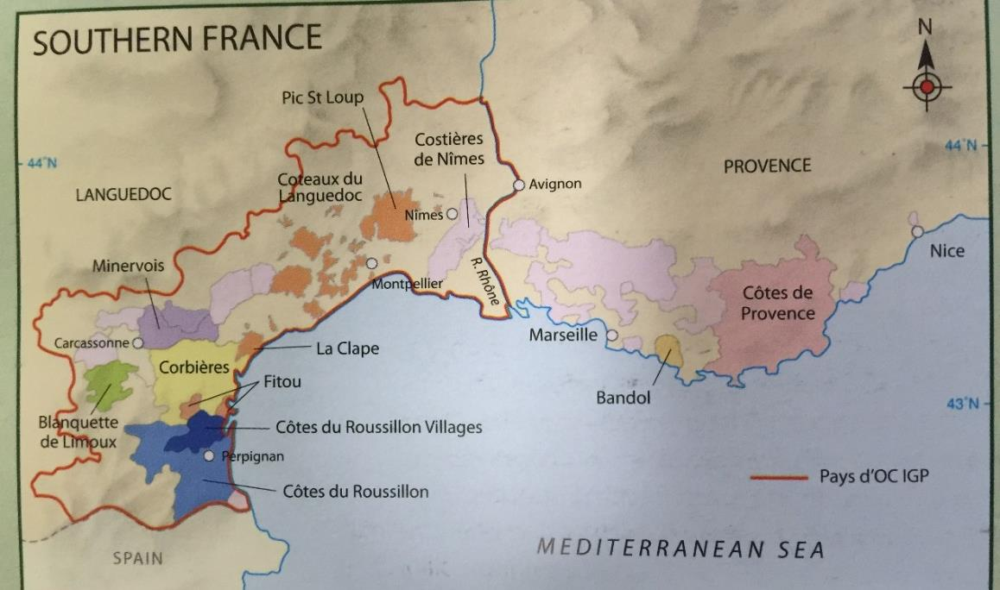

# Languedoc, Roussillon, Provence

## Southern France 概述

### 历史与概述

南法的葡萄园分布在地中海沿岸，从意大利一致延伸到西班牙边境。历史上，这里的兴起起源于铁路连接到了这一带，当时南法的酒与北非的酒常混合在一起出售。但随着阿尔及利亚的独立和法国加入欧盟，这里不得不采取变革。在法国的所有葡萄酒产区中，南部在近年来经历了最大的变化，生产商们不断地改进产量过剩和质量较低的问题，采用拔出高产的葡萄藤改种国际品种，舍弃低品质的葡萄园改种其他作物等做法。1970 年 VDP 法律实施以后，这里更是大量实验新的品种并吸引了许多新世界的酿酒师和栽培者，投资也不断涌向这里。如今，这里从大批量低质量的餐酒 Vin de Table 逐渐转向生产 IGP 和 AOC 的葡萄酒，但这种情况也不能一概而论。

一方面，这些 IGP 和 AOC 的葡萄酒在不断致力于表达当地风土的多样性，其质量年年攀升，最求现代化，是高性价比酒的重要产区，同时也有一些价格高昂的顶级葡萄酒，另一方面，这里仍然有着法国最大面积的葡萄园，依然有许多缺少竞争力和投资的生产商，他们缺少资金，也缺少改进的动力。

### 气候

这里有着温暖的地中海气候，日照充足（尤其是 Roussillon，一年超过 320 天日照），生长季的降雨量很少（可低至 400mm，且常为暴雨），干旱是个问题。春季到来很早，夏季则常超过 30 度，秋季漫长而冬季温暖潮湿。对于栽培葡萄而言，这是一个理想的环境。在内陆山脚下的葡萄园相比沿岸地区更加凉爽，有着出色的温差和分明的四季（冬季休眠），土壤也更适合栽培高品质的葡萄。大风也会影响气候，北边吹来的凉爽干燥的风（mistral 和 tramontane）能给葡萄园降温。南边吹来的温暖而潮湿的风则会给沿岸地区带来夏季暴雨。

### 土壤

法国南部的土壤有着丰富的多样性，海拔和风也影响着这里的微气候和葡萄质量。在河谷一带土壤比较肥沃，在罗纳河三角区则以冲积土为主，平原上以黏土和砾石土壤为主，石灰岩也很常见。Roussillon 则多为含铁红色黏土，此外还有十余种土壤。

### 品种

#### 红葡萄品种

在法国南部，红葡萄占到了 3/4 以上的比例。在近 20 年来，葡萄园里的品种在不断发生着变化，如今这里有着各式本地的和国际的红白葡萄品种。

主要红葡萄品种包括：

- **Grenache** - 种植量最广的品种，特别适应当地炎热干燥的环境
- **Syrah** - 种植量排第二，特别是在最近二十年增加显著，适合种植在气候相对温和的地区
- **Carignan** - 种植量排第三，拥有深色、高单宁和高酸度，但缺少果香和细腻。种植在贫瘠土壤的老藤的 Carignan 能生产出高质量的葡萄酒
- **Mourvedre** - 只能在最炎热的地区成熟，在混合中能增加饱满度、颜色和复杂性，但种植量不大
- **其他品种** - 梅洛、赤霞珠和 Cinsault 也有种植，但种植量很少

#### 白葡萄品种

主要白葡萄品种包括：

- **霞多丽和长相思** - 种植量最大，主要生产 IGP 葡萄酒
- **Viognier** - 种植量在不断增长
- **Muscat** - 被广泛种植用来酿造 VDNs，是种植量最大的当地品种
- **Grenache Blanc** - 是种植量最大的本地品种，但在不断减少
- **其他特色本地品种**：
  - Mauzac（主要种植在 Limoux）
  - Picpoul（种植在 Pinet）
  - Maccabeu（种植在 Roussillon）
  - Rolle（种植在 Provence）
  - Clairette（种植在 Languedoc 和 Provence）

### 种植

温暖干燥的气候意味着干旱是最大的问题，而真菌疾病则极为罕见，因此有机栽培很普遍。这里有超过 1000 家有机和生物动力的生产商，数量占全法国第一。Bush trained 是主流的栽培方式，尤其是本地品种，但 VSP 和 big vines 对于国际品种而言也比较常见。无论用何种整形方式，让葡萄保持低产是质量的关键。

灌溉是允许的，但有限制，往往只有最出色的和最大批量低质量的生产商才会建立灌溉系统。平坦的地势使得机械化采收很普遍，但由于许多葡萄园比较分散，对于机械化采收也是个限制。

### 酿造

随着现代化设备的投资，酒窖卫生、温控设备、氧气管理、橡木桶的合理使用等等举措都让葡萄酒的质量大大提升。二氧化碳浸渍法的使用仍然很普遍，这一做法尤其能柔和 Carignan 的单宁。但依然有许多设备并不那么先进的酒庄，他们缺少资金，除梗设备和新橡木桶等对于他们来说都是太奢侈的投资。发酵和熟化传统上使用大型水泥罐，不锈钢设备在逐步引入。装瓶也往往是依靠酒商了进行，而不是在酿造的地方装瓶。

### 市场

在南法，合作性酒庄是最重要的，这里有大大小小数百家的合作性酒庄，它们还常常属于更大的葡萄酒集团公司所有。

## Languedoc-Roussillon

### Languedoc-Roussillon Appellation Wines

自 1985 年以来，只有大约 10%的 Languedoc-Roussillon 葡萄酒属于 AC 等级。因为 AC 系统在南法的建立是一个逐步的过程，当地的管理委员会 CIVL 致力于建立一套 AOC 的清晰的等级制度，以让消费者更容易理解 Languedoc 的葡萄酒。

#### Languedoc AC

2007 年，原来的 Coteaux du Languedoc AC 被重新命名为 Languedoc AC，包含了整个 Languedoc-Roussillon 的区域。主要特点：

- 红酒饱满而有香料风味，主要品种为 Carignan 和 Cinsault（均不能超过混合的 40%），其余主要为 GSM
- 白葡萄酒主要使用 Grenache Blanc，Clairette，Picpoul 和 Bourboulenc 等品种酿造
- 有不少桃红葡萄酒
- 以合作性酒庄为主导

#### 重要子产区

1. **La Clape**

   - 是一座平原上独立的小山，靠近海岸
   - 生产酒体饱满的红葡萄酒
   - 风格与其附近的 Corbieres 相似
   - 也产一些 Bourboulenc 为主混合的白葡萄酒

2. **Montpeyroux**

   - 高海拔 schist 土壤
   - GSM 和佳丽酿混合的红酒为主
   - 产量很低，因此风味浓缩

3. **Pic-St-Loup**

   - 位于高海拔的山脚处
   - 有一些出色的独立生产商
   - 生产浓缩而优雅的红葡萄酒，GSM 为主，Carignan 很少

4. **Picpoul de Pinet**
   - 白酒产区，只能使用 Picpoul 酿造
   - 高酸而有芳香的柠檬风味
   - 一般使用夜间机械采收
   - 80%为 Co-ops 生产

#### 其他重要 AC 产区

1. **Saint-Chinian**

   - 高性价比的产区，位于干旱多山的环境
   - 红酒为主，也产新鲜干型的桃红和白葡萄酒
   - 分为南北两个区域：
     - 南部：以黏土和石灰岩为主，红酒品种为 GSM 和 Carignan
     - 法律鼓励使用 GSM 而限制 Carignan
   - 有一些出色的老藤 Carignan 葡萄园和两个 grand cru

2. **Faugères**

   - 约 2000ha
   - 位于山间海拔较高，schist 土壤
   - 主要种植地中海品种
   - 风格介于南罗纳河的香料风味和 Corbiere 的粗犷风格之间
   - 也产一些 Roussanne，Marsanne，Vermentino 等品种混合的白葡萄酒
   - 三家 Co-ops 生产 50%的酒

3. **Minervois**

   - 4300ha
   - 位于内陆 Massif Central 的斜坡上
   - 风格柔和的红酒为主（95%）
   - 也有一些桃红和白葡萄酒
   - 最出色的子产区 La Liviniere 为 grand cru，有独立 AOC

4. **Corbières**

   - 面积较大，12000ha
   - 特点：
     - 沿岸地区较为温暖
     - 内陆海拔可达 600 米，受 tramontane 风的凉爽影响
     - 土壤和地势类型众多
   - 主要生产浓郁、herby 的红酒（95%）
   - 品种：
     - 以 Carignan 为主
     - 混合 GSM 和 Lladoner Pelut 等品种
   - 分为 11 个子产区，最出色的 Boutenac 为 grand cru

5. **Fitou**

   - 紧挨着 Roussillon 的北部的红酒（100%）产区
   - 分为两个地区：
     - 温暖的沿岸地区生产酒体饱满的葡萄酒
     - 内陆高海拔凉爽的产区生产更为轻柔风格的葡萄酒
   - 以合作性酒庄为主
   - 南法第一个 AOC 产区（1948 年建立）

6. **Limoux**

   - 特点：
     - 位于 Pyrenean 的山脚处
     - 远离地中海，高海拔且气候凉爽
     - 是起泡酒的重要产区
   - 白葡萄酒：
     - 使用霞多丽（主要）、白诗南和 Mauzac
     - 橡木桶发酵并熟化至少 7 个月
     - 被认为是全法最优质的霞多丽产区之一
   - 红酒（2005 年起）：
     - 需至少 50%的梅洛
     - 至少 30%的佳丽酿、马尔贝克、西拉和歌海娜
     - 不超过 10%的 Carignan
     - 允许使用赤霞珠和品丽珠

7. **Côtes du Roussillon**

   - 4300ha
   - 特点：
     - 崎岖而多山
     - 日照时间很长（一年 325 天）
     - 降雨量小，风很大
   - 能生产非常浓缩的葡萄酒
   - 产量构成：
     - 红酒 85%
     - 白葡萄酒酸度较低，使用传统品种

8. **Côtes du Roussillon-Villages**
   - 位于 Côtes du Roussillon 内的北部多山地区
   - 仅产红酒
   - 特点：
     - 酒精度较高
     - 需要至少三个品种的混合
     - 鼓励使用西拉和慕合怀特而限制 Carignan
     - 禁止使用 Cinsault 和 Macabeo
   - 允许使用二氧化碳浸渍法以柔化单宁，增加果味

### IGP Wines

#### IGP 概述

最初一些坚持种植国际品种的生产商只能选择生产 IGP 级别的葡萄酒，哪怕他们当中有很多质量非常出色。逐渐的，这种现象从小众转向了普遍，许多生产商和私人投资者都选择在这片理想的葡萄栽培区域酿造国际品种。

AOC 体系是在葡萄根瘤蚜爆发后假酒横行时设立的，旨在保护原产地的名声和风格特点。AOC 法律一般规定了生产区域、葡萄品种（比例）、成熟度（酒精度）、种植方式、产量、酿酒方法（熟化要求）等等。各个 AOC 产区的规定差异很大，一个产区内部的 AOC 等级关系也各不相同。IGP 级别，或者 Vins de Pays 级别，其规定则相对松散，尤其是对于葡萄品种的规定不那么严格。除了 AOC 和 IGP，最低级别为 Vin de France，允许跨区域并标识品种，适合大型品牌的建立。

#### IGP 分类

法国有三种 IGP：

1. **大区级 Regionaux**

   - 共六个，Pay d'Oc 是最重要的
   - Pay d'Oc 覆盖整个 Languedoc-Roussillon，约 9 万公顷
   - 产量限制为 80hl/ha
   - Grand d'Oc 为更高等级，产量限制 42hl/ha

2. **省级 Department**

   - 在法国全部 101 个省中，有 54 个有自己的省级 IGP
   - 包括 Gard，Hérault，Aude，Pyrénées-Orientales 等

3. **区域级 Zone**
   - 共 93 个，范围往往比省级更小
   - 包括 Côtes Catalanes 等

#### IGP 特点

- 品质出众、价格合理
- 标识品种（85%原则）
- 葡萄成熟但风格简单易饮
- 模仿新世界的风格
- 在国际出口市场上有竞争力
- 占全法国 60%的 IGP 葡萄酒产量

## Provence & Corsica

### Provence

#### 概述

- 历史可追溯到公元前 600 年
- 产区被山脉分割
- 山脉阻挡 mistral 风
- 多样的气候和土壤（limestone 和 schist 为主）
- 允许种植十余种葡萄品种

#### 种植特点

- 传统以 gobelet 为主
- 新葡萄园多为 Guyot 以方便机械化
- 桃红酒占 75%的产量

#### 主要产区

##### Côtes de Provence AC

- 最大的 AC 产区，20000ha
- 产量构成：
  - 桃红占 4/5
  - 红酒占 15%左右
- 特点：
  - 众多 Co-ops 和小型酒庄
  - 桃红需包含至少 20%的 saignee 法制作的基酒
  - 红酒中赤霞珠和西拉不超过 30%
- 有 Cru Classe 分级体系（1955 年建立，目前 18 家酒庄）

##### Coteaux d'Aix-en-Provence

- 主要特点：
  - 以桃红为主
  - 需至少 30%的 saignee 法制作基酒
  - 以合作性酒庄为主
  - 有机种植普遍
- 品种多样：
  - GSM，Cinsault，Carignan
  - 赤霞珠和 Counois 等
  - Carignan 和赤霞珠不超过 30%
- 白葡萄酒以 Rolle 为主，混合酿造

##### Bandol AC

- 位置特点：
  - 位于 Toulon 附近
  - 陡峭的梯田葡萄园（禁止机械采收）
  - 土壤以黏土、石灰岩和砾石为主
- 酒品特点：
  - 以 Mourvedre 为主（至少 50%）
  - 红酒需 18 个月橡木桶熟化
  - 桃红占 60%
  - 少量白葡萄酒
- 产量小，质量高，价格高

### Corsica

#### 地理与环境

- 地中海岛屿，靠近意大利
- 葡萄园主要位于沿岸地区
- 四种主要土壤：
  1. 西侧：花岗岩（多种植 Sciaccarello）
  2. 北侧：schist（适合 Vermentino/Rolle）
  3. 南边：clay 和 chalk（Nielluccio/Sangiovese 主要种植区）
  4. 东侧：沙土和冲积土（主要为轻盈果香型红酒）

#### 气候特点

- 比法国任何区域都更温暖
- 典型地中海气候
- 夏季几乎没有雨

#### 葡萄品种

主要品种：

1. **Nielluccio**

   - 可能起源于意大利（Sangiovese）
   - 种植量最大
   - 用于酿造桃红和红葡萄酒
   - 优质酒具有深色和出色的单宁酸度结构

2. **Vermentino**
   - 也叫 Malvoisie
   - 可酿造两种风格：
     - 清爽的白葡萄酒
     - 酒体饱满、果香成熟的风格

#### 生产特点

- 70%由合作型酒庄生产
- 现代化进展：
  - 不锈钢罐和温控设备的使用
  - 现代酿酒技术（橡木桶、酒泥、MLF 等）
- 产量构成：
  - 30%桃红
  - 10%白葡萄酒
  - 红葡萄酒占主要比例

#### 主要产区

##### Vin de Corse AC

- 最主要的大区级产区
- 包含红、白和桃红葡萄酒
- 要求：
  - 红和桃红葡萄酒：Nielluccio，Sciaccarello 和 Grenache 需占至少 50%
  - 白葡萄酒：需至少 75%的 Vermentino
- 主要在本国消费，风格简单易饮

##### L'Ile de Beauté IGP

- 占全岛 60%的产量
- 主要用于出口
- 随着 table wine 减少而增加
